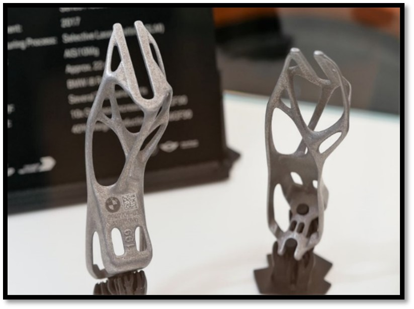

# Additive Manufacturing
---

We name the Additive Manufacturing (AM) industry “additive” because it involves constructing products from the bottom up rather than milling or carving a form out of a larger block or casting a molten substance in a mold. A French artist, François Willème, was the first to make a 3D sculpture digitally by using 24 cameras to capture the same subject from several angles. In 1892 Joseph E. Blanther received a patent for creating the first 3D topographical mapping method. At the beginning of the 2000s, the AM industry hit some significant milestones, such as the introduction of Selective Laser Sintering (SLS), Fused Deposition Modelling (FDM), Colour Jet Printing (formerly known as ZPrinting), and commercialisation of 3D printed products. Currently, additive manufacturing technologies enable the fabrication of parts and devi
ces that are geometrically complex. These parts can be individualised on a customer level, as shown in [Figure 1].

  

    <i>
    Figure 1: Custom print of a BMW i8 metal bracket
    </i>

We can see a custom printed metal bracket to open and close the rooftop for the BMW i8 cabriolet. Because of the volumetric nature of this design, there is no way to retrieve it unless we destroy the mold used in conventional manufaturing. 3D printing techniques, on the other hand, do not require the usage of a mold hence, they reduce the ecological footprint. A second example of suppressing the environmental impact when printing products is by lowering stock. A product should only be printed when required and can be printed locally when demanded by the customer. Finally, manufacturing complex geometry using 3D printing comes for free because the printer does not need extra components to print a complex shape. A set of instructions are executed when printing a shape, and these instructions are the same for simple or complex geometry. In contrast, traditional methods might require different machines to achieve the same result. 