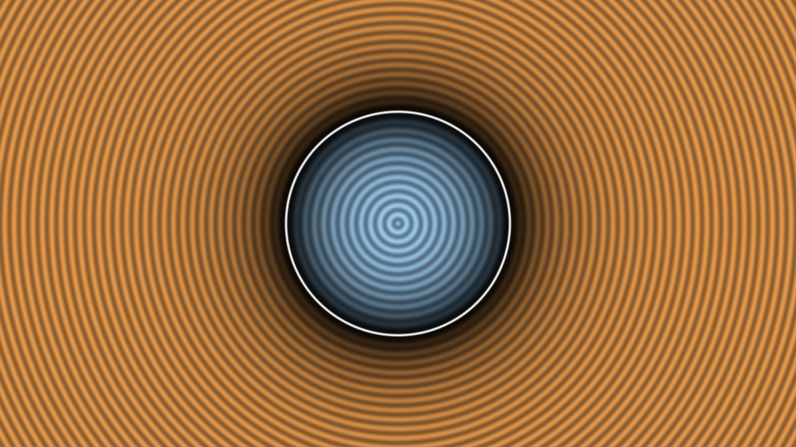
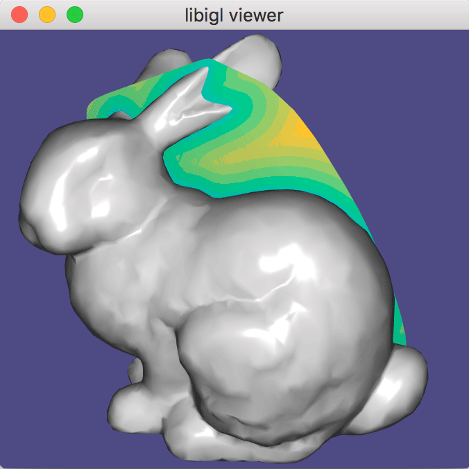
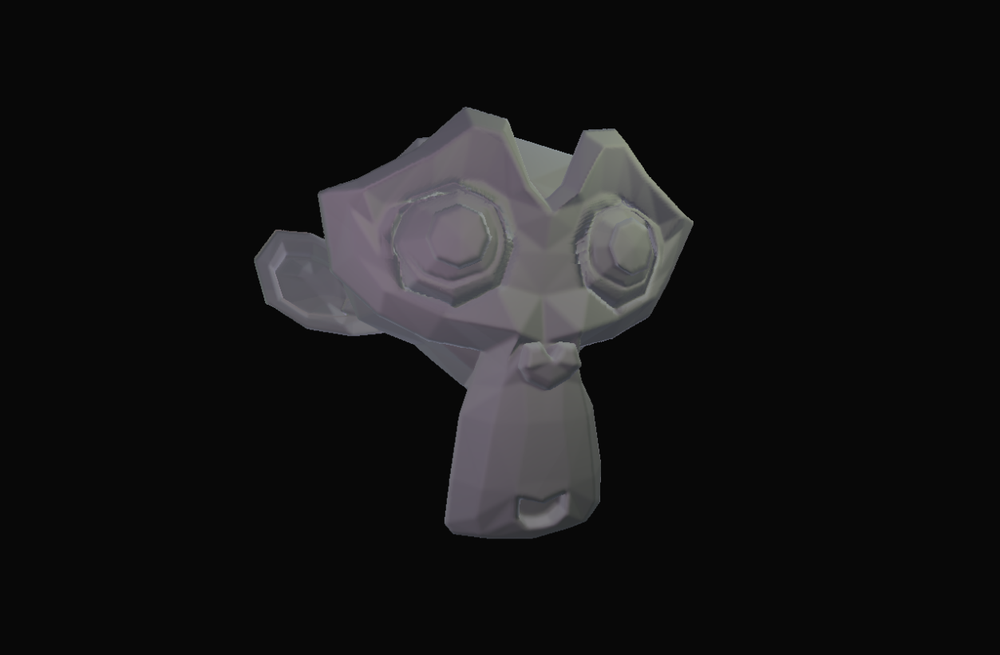
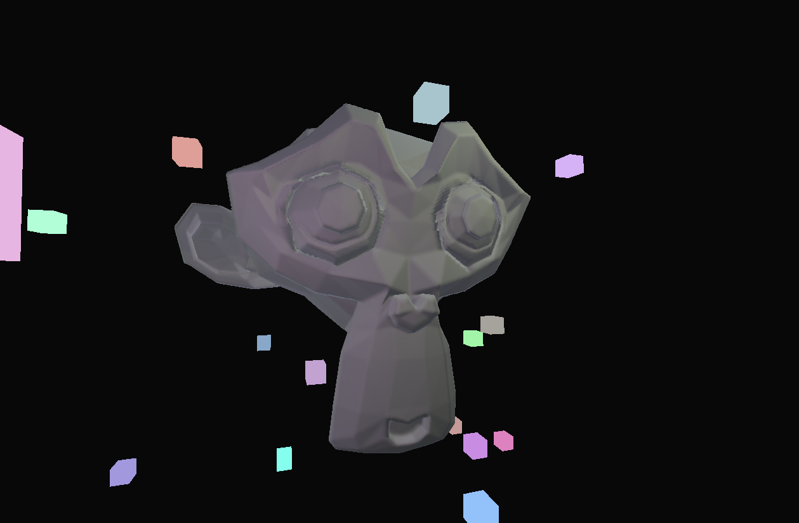

# Introduction

Within modern society, many media devices exist. Having a responsive software product on any device would benefit different industries, such as individualising three-dimensional (3D) printed products, medical visualisations representing a diagnosis in a 3D environment, and even games to support a more extensive player base. 

We will explore an example from the Additive Manufacturing (AM) industry. One of the complex structures AM recently took interest in are lattice structures. Lattices are a geometrical arrangement of crisscrossed patterns that can generate all types of geometry without losing structural integrity. However, visualisations of lattice structures using computer graphics can become hard to render on sub-optimal hardware. Depending on the size of the lattice, polycount can reach millions of triangles which is not feasible to visualise optimally on consumer hardware in real-time. Additionally a representation of such geometry within a modelling tools such as MAYA or Blender necessitates a high level of knowledge, patience, foresight and meticulous preparations to ensure that models have adequate control vertices where details is desired. 

<br>
<p align="center">
  
</p>
<p align="center">
    <i>
    Figure 1: Example of a lattice structure in the shape of a shoe – Carbon 3D
    </i>
</p>
<br>

In this article, we propose a solution for developers to create a 3D renderer that uses a volumetric approach to visualise these structures. Our target platform will be the web, focusing on chromium browsers. This also means that state of the art technology such as mesh-shaders or raytracing are not available. However, this will make sure that our solution is compatible with all kinds of platforms as a more generic approach is utilized to achieve the desired outcome. Volumes have shown promising results in visualising high fidelity geometry without the cost of uploading the required surface-based data to the GPU. An added benefit of volumes is that they can perform Boolean operations more efficiently.

<br>

# Preliminaries

Before we can talk about the process of creating a volumetric rendering pipeline. Some key mathematics and programming ideas involved within this article have to be explained. 

<br>

## Distance Fields 

A distance field is a scalar field that specifies the minimum distance to the surface of a shape. If we examine this in more detail, a distance field can be represented by a function <b>F</b>, such that any given point <b>P</b> will return a distance <b>d</b> from the object represented by the function. We store the distances returned by such a function as 3D matrices or, more commonly known within graphics programming, a 3D texture. Each texture cell stands for the closest distance from the grid element to the nearest surface. Therefore, a grid element containing a value of 0 represents the surface of a shape. 

<br>
<p align="center">
  
</p>
<p align="center">
    <i>
    Figure 2: A circle is represented by a 2D distance field – Inigo Quilez 
    </i>
</p>
<br>

## Sphere Tracing

Visualising a distance field can be achieved by using an algorithm called sphere tracing. Sphere tracing is a technique for rendering implicit surfaces using a geometric distance. Which is exaclty what we stored within our 3D texture. To find the distance towards a shape, we need to define a distance function for it or have a generated volume available to trace against. For example, a sphere with center (x_0,y_0,z_0) situated at the world origin (<b>P</b>) and radius <b>r</b> can be representated as followed:

<br>
<p align="center">
<i>P^2-r^2=0</i>
</p>
<br>

This equation is what is called an implicit function. A sphere represented in this form is also called an implicit shape. An implicit equation only tells us if a particular point is inside a shape (negative values), outside a shape (positive values), or precisely on the surface (value of 0). The collection of points where the implicit function equals x is called an iso-surface of value x (or iso-contour in 2 dimensions). Sphere tracing is a method of drawing a surface solely based on this data. For more information about sphere tracing, click [here](sphere_tracing.md)

<br>

## Boolean Operations

Volumetric data can easily represent shapes defined via Boolean operations. These operations are often used in CAD software in collaboration with a technique called Constructive Solid Geometry (CSG), which consists of the same operations only based on surface-data not on geometry, which makes this algorithm a lot more CPU intesive as new geometry has to be constructed on the fly. Modelling complex shapes by assembling simple shapes such as spheres, cubes, planes might be hard to achieve if we modelled our geometry by hand. Being able to blend implicit shapes is a quality that parametric surfaces lack and thus one of the main motivations for using them. For more information about Boolean operations, click [here](boolean_operations.md)

<br>

## Deferred Shading

Deferred rendering or deferred shading is based on the idea that we defer most heavy calculations (such as light calculations) to a later stage. We can achieve deferred shading with one geometry pass and one light pass. The geometry pass renders the scene once and stores distinct data about the displayed geometry in different textures, commonly known as the G-buffer. Position vectors, color vectors, normal vectors, and/or specular values make up the majority of this data. In the second pass, we render a full-screen quad and calculate the final render using the provided G-buffer. We only need to do our light calculations once when deferring them to a later stage because the G-buffer contains all of the data from the topmost fragment. If deferred rendering is a little fuzzy I highly recommend reading the following article: [Learn OpenGL: Deferred Shading](https://learnopengl.com/Advanced-Lighting/Deferred-Shading) from Joey De Vries.

<br>

# Strategy

Now that we've caught up, we can start working on a volume renderer. Any watertight (closed, non-self-intersecting, manifold) mesh can be used to construct a volume. There are already a lot of tools that can produce a volume for us, such as the Unity build-in tool named [SDF Bake Tool](https://docs.unity3d.com/Packages/com.unity.visualeffectgraph@12.0/manual/sdf-bake-tool-window.html). However, we opted for a more programatical approach and used a library called [IGL](https://libigl.github.io). This library is developed in C++ and may be used to produce a volume as part of our pipeline. The steps for creating a volume with the IGL library are as follows. First, we import a mesh (which is also possible using an IGL function igl::readObj). Next we feed the data that was imported into IGL's signed distance function:

<br>

```cpp
    // Choose type of signing to use
    igl::SignedDistanceType type = SIGNED_DISTANCE_TYPE_PSEUDONORMAL;
    igl::signed_distance(P,V,F,sign_type,S,I,C,N);
```
<br>

When executing this function properly a volume should be created.

<br>
<p align="center">
  
</p>
<p align="center">
    <i>
    Figure 3: Generated signed distance field of the Standford Bunny - IGL.
    </i>
</p>
<br>

As previously indicated, we employed a deferred rendering approach to incorporate our volumetric renderer into a conventional rendering pipeline. This means that our volumetric framebuffer will produce a G-Buffer. This G-Buffer was built by leveraging our sphere-tracer within the fragment shader of our render pass. This renderpass might be created using the following pseudocode:

<br>

```cpp:
    /*
        color attachment 00: stores position of the surface that was hit
        color attachment 01: stores normal of the surface that was hit
        color attachment 02: stores albedo (RGB) and specular (A) of the surface that was hit
    */

    color_attachments.add(create_color_attachment(Format::RGB_32_FLOAT));
    color_attachments.add(create_color_attachment(Format::RGB_32_FLOAT));
    color_attachments.add(create_color_attachment(Format::RGBA_32_FLOAT));

    framebuffer = ResourceFactory::create_frame_buffer(color_attachments);

    /*
        What remains is adding this framebuffer to the pipeline.

        Our sphere tracer is a full screen image effect so we only require position and texcoord.
        Depth testing and face culling can be disabled.
    */

    pipeline_desc.layout = { {DataType::VEC3, "a_Position"}, {DataType::VEC2, "a_TexCoord"} };
    pipeline_desc.framebuffer = framebuffer
    pipeline_desc.depth_test_state = { DepthTestEnabled::NO };
    pipeline_desc.facecull_state = { FaceCullingEnabled::NO };

    create_pipeline(pipeline_desc);
```

<br>

Accompanied with this render pass comes a shader which traces against our generated volume.

<br>

```c
    out vec3 g_Position;
    out vec3 g_Normal;
    out vec4 g_Albedo_Spec;

    void main(void) 
    {
        ray_origin = get_ray_origin(v_camera_world);
        ray_direction = get_ray_direction(v_camera_world);

        raymarch(ray_origin, ray_direction);

        if(HIT_NOTHING || HIT_MAX_MARCH_DISTANCE)
            discard;

        if(HIT_SURFACE)
        {
            position = ray_origin + (ray_direction * distance_travelled);
            normal = calculate_normal(position);

            RenderResult render_result;

            g_Position = position;
            g_Normal = normal;
            g_Albedo_Spec = get_material(suface_id);
        }
    }
```

<br>

We now have all of the data we need to develop a high-quality renderer. The data in the G-Buffer is given to the lighting pass, which calculates all relevant lighting information needed to illuminate our scene. Furthermore, the produced frame might be enhanced using other rendering techniques such as ambient occlusion, reflection, or subsurface scattering. Other material attributes, such as roughness and metallicity, might be added to the lookup table in addition to albedo and specular values. This would allow us to make a PBR material that we could use on our traced volume (We opted simple diffuse shading since light propagation and varied visual effects are not the focus of this post). Finally, to create a depth buffer, the travelled distances might be translated back to the camera's distance. The depth buffer could be used to create a hybrid approach that combines surface-based geometry with volumetric data in the same scene.

<br>

# Summary

All relevant data of our volumetric renderer can be stored within a G-Buffer, this allowes us to utilize the output of our framebuffer in a deferred rendering pipeline.

<br>
<p align="center">
  
</p>
<p align="center">
    <i>
    Figure 4: Example of the G-Buffer.
    </i>
</p>
<br>

We can use this G-Buffer to calculate any light information that is required in our scene and any additional image effects that might be required such as ambient occlusion

<br>
<p align="center">
  
</p>
<p align="center">
    <i>
    Figure 5: Example of a lit scene, generated from a given G-Buffer.
    </i>
</p>
<br>

To achieve a hybrid renderer we can export a depth buffer by converting the "true" distance to the scene back to camera distance.

<br>
<p align="center">
  
</p>
<p align="center">
    <i>
    Figure 6: Light fixtures (cubes) added on top of a volume rendered frame.
    </i>
</p>
<br>

# Conclusion

Distance field rendering in its current state is neither robust or fast enough for large-scale commercial video game productions. Nonetheless, in comparison to today's industry norms, the simplicity of these techniques makes them desirable for rendering and other use cases such as modelling. Algorithms and rendering technology will advance over time, allowing for efficient hybrid or full-on volume rendering within game development. 