# Assets
---

Renders of each assets used within this experiment. All renders are generated using Blender ( v. 2. 93. 1. )

  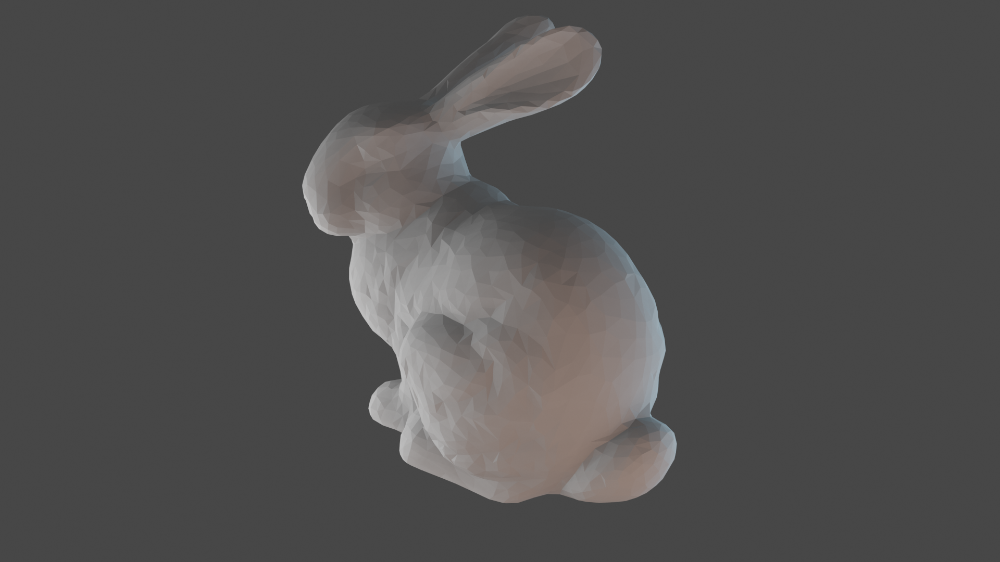

    <i>
    Figure 32: Standford Bunny
    </i>

  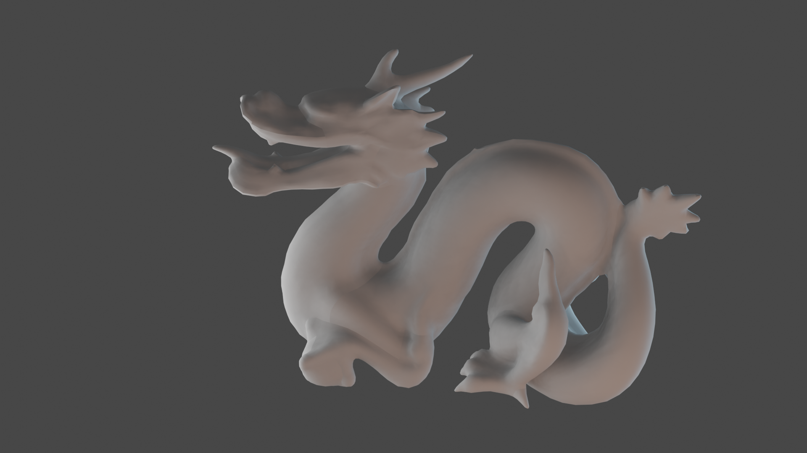

    <i>
    Figure 33: Standford Dragon
    </i>

  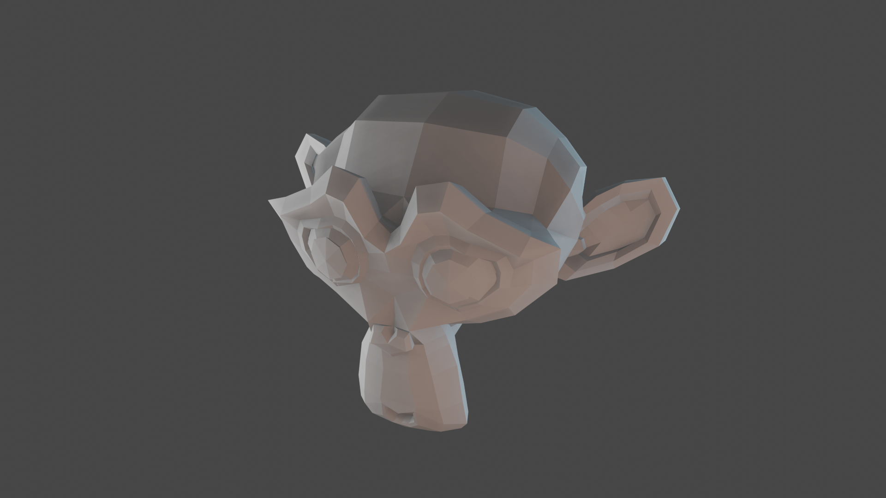

    <i>
    Figure 34: Blender Suzanne
    </i>

  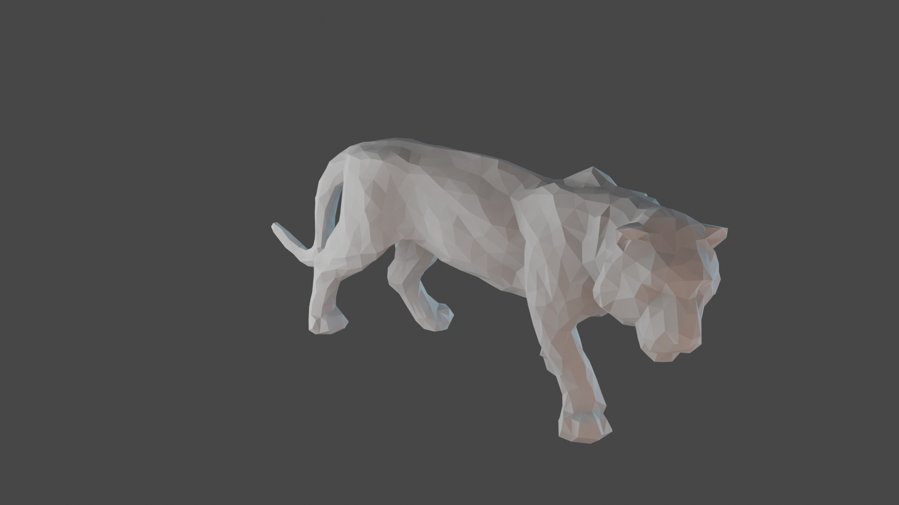

    <i>
    Figure 35: Tiger
    </i>

  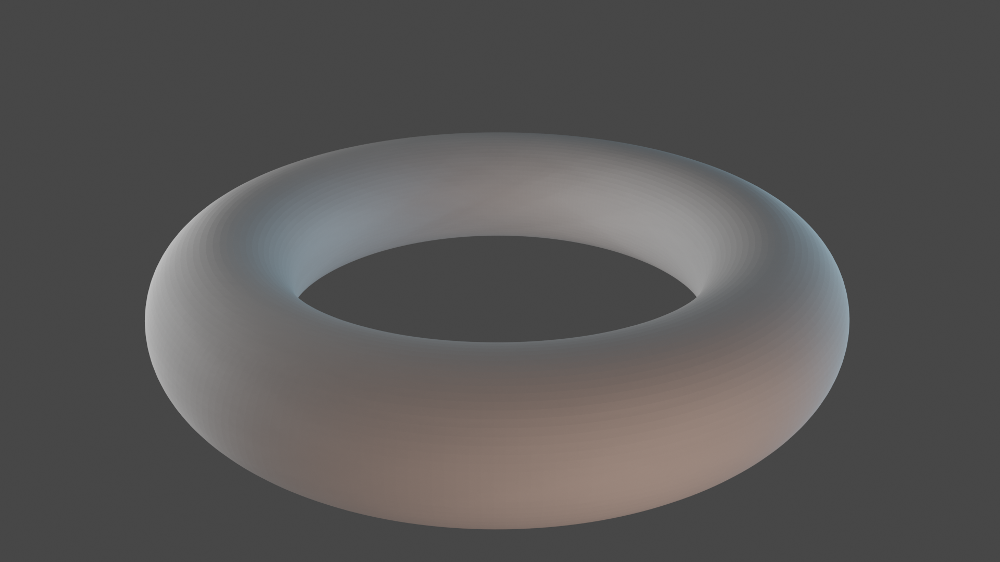

    <i>
    Figure 36: Torus
    </i>

  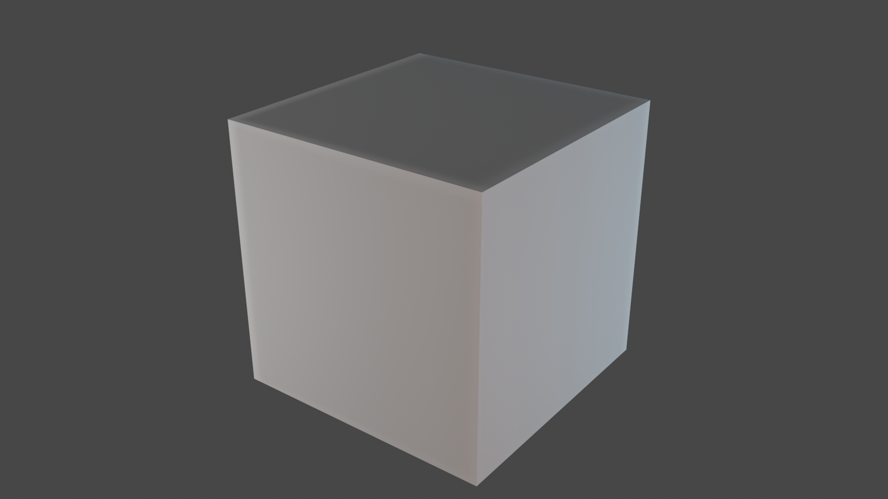

    <i>
    Figure 37: Cube
    </i>

Each unit cell implemented within this prototype. Each of the meshes visualised above could be lattified with one of the unit cells presented below.

  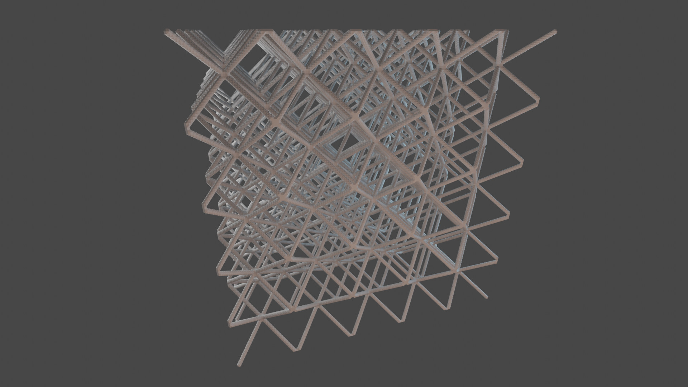

    <i>
    Figure 38: Cross – Unit Cells
    </i>

  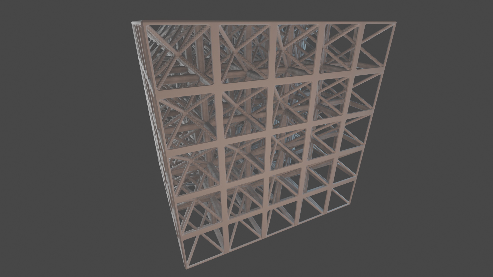

    <i>
    Figure 39: Cross Cube Ribs– Unit Cells
    </i>

    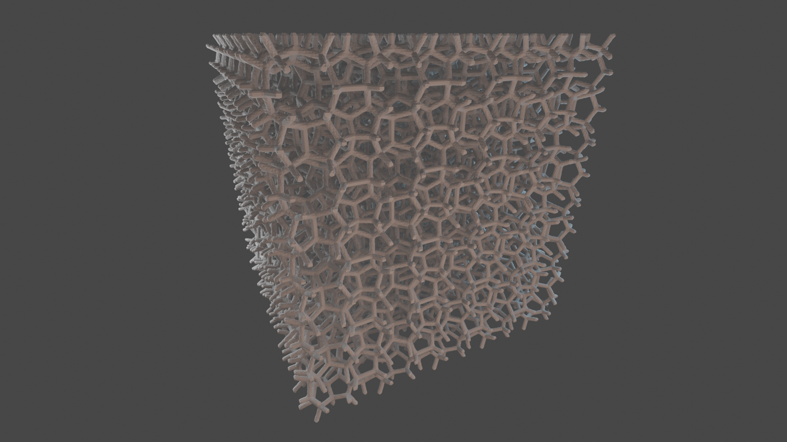

    <i>
    Figure 40: FKA – Unit Cells
    </i>

    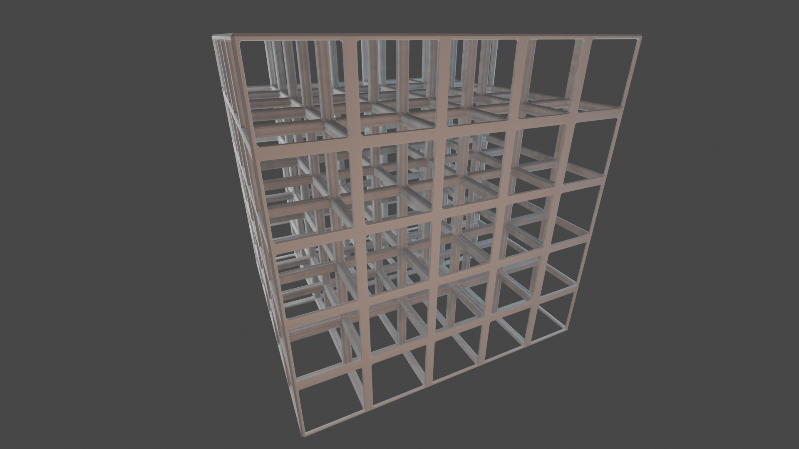

    <i>
    Figure 41: Cube Ribs – Unit Cells
    </i>

    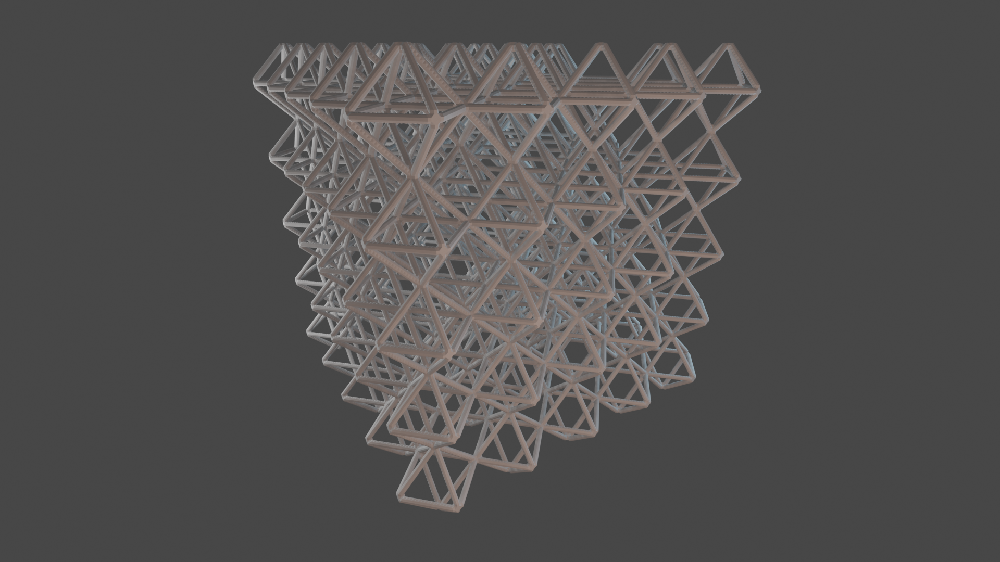

    <i>
    Figure 42: Octahedron Ribs – Unit Cells
    </i>

  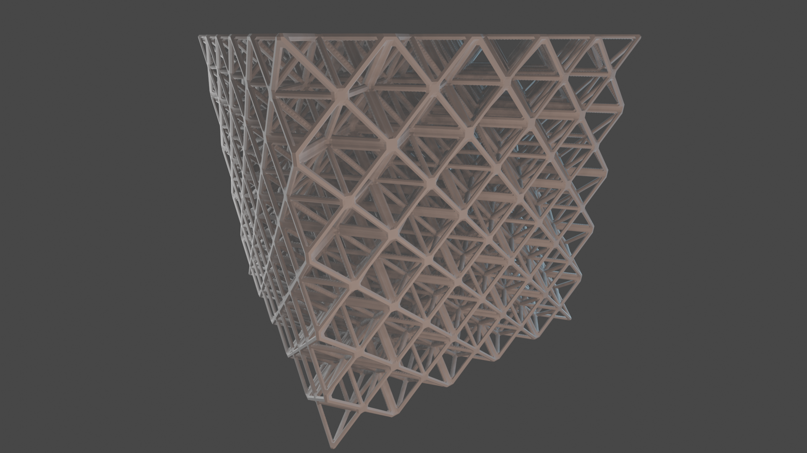

    <i>
    Figure 43: Double Tetrahedron Octahedron Ribs – Unit Cells
    </i>

  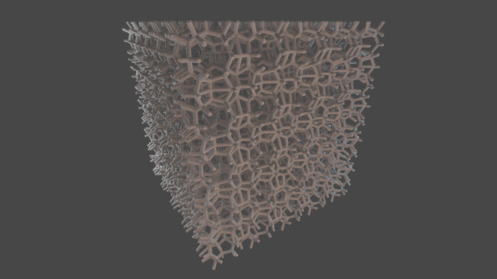

    <i>
    Figure 44: OECHS – Unit Cells
    </i>

  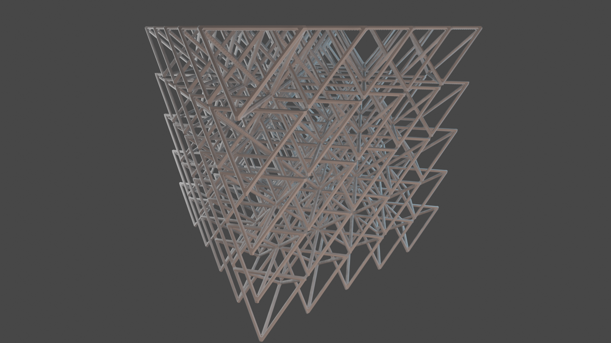

    <i>
    Figure 45: Tetrahedron Ribs – Unit Cells
    </i>

