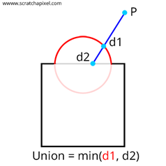
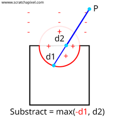
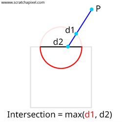

# Boolean Operations
---

Our primary motivation for using sphere tracing is that it can easily represent shapes defined via Boolean operations. These operations are often used in a technique called Constructive Solid Geometry (<a href="https://en.wikipedia.org/wiki/Constructive_solid_geometry">CSG</a>), which consists of modelling complex shapes by assembling simple shapes such as spheres, cubes, planes, cones, etc. The outcome of these operations might be hard to achieve if we modelled our geometry by hand, and being able to blend implicit shapes is a quality that parametric surfaces lack and thus one of the main motivations for using them. 
One of the most fundamental actions is to combine two things, which is best expressed mathematically as the union operator. As illustrated in [Figure 1], you may achieve this effect by simply returning the smallest distance between the two shapes you want to merge.

  

    <i>
    Figure 1: Union
    </i>

You may also subtract the volume of one form from another, which is best expressed mathematically as a set difference operator (also known as a subtraction). To do so, you first need to invert the sign of the distance estimator of the first shape. When examining [Figure 2], it’s clear that the sphere's interior now provides a positive signed distance to the surface, whereas any point outside the sphere now gives a negative signed distance. Then take the maximum of the two distances to create a hole in the second object that’s equal to the shape of the first object.

  

    <i>
    Figure 2: Subtraction
    </i>

One last example could be calculating the surface resulting from the intersection of two surfaces. We can compute this (as illustrated in [Figure 3]) by taking the largest distance using the max operator. What these operations have in common is that they use Boolean operators, hence the name Boolean operations. 

  

    <i>
    Figure 3: Intersection
    </i>

Note that these operations only have a valid distance representation outside the shape (positive values). Even though these operations work for visualisation, evaluations used by these operations will only return a lower bound to the actual distance of the resulting surface. However, this is not an issue for our use case, which is rendering implicit geometry, as we will never “march” within the object.

  <i>Images are taken from <a href="https://www.scratchapixel.com">scratchapixel.com</a></i>

