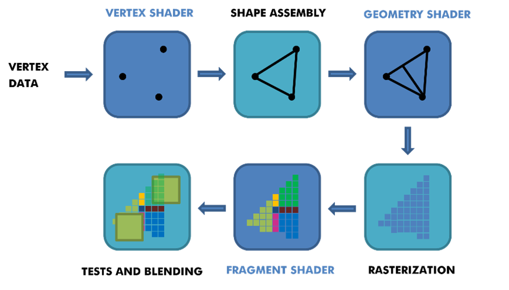

# Computer Graphics
---

Hardware has come a long way in rendering geometry on the screen. According to Moore’s Law, processing power will double every two years, and since 1970 this prediction has been proven true. We measure a Central Processing Unit (CPU) ’s processing power in Floating Operations Per Second (FLOPS). In [Appendix A.1], we can see an overview of the processing power of different CPUs and the incrementation of FLOPS throughout the years. Even though CPUs can rasterise geometry successfully, we introduced the GPU to take over this task, as it could handle the required steps to rasterise geometry on the screen much faster.

In computer graphics, we utilise a graphics pipeline for the rasterisation of geometry. The graphics pipeline is a combination of steps executed in sequence to project our geometry on the surface of a screen. The steps required to perform this operation depend on software and hardware. Thus, no universal graphics pipeline solution exists for all cases. Still, different Application Programming Interfaces (API)  such as Direct3D, Vulkan, Metal, and OpenGL have been created to unify similar steps and control the graphics pipeline of a given GPU. These Hardware Abstraction Layers (HAL) keep the programmer away from writing code to manipulate graphics hardware accelerators. 

The steps that make up a graphics pipeline are split into two sections. The first part, known as the geometry stage, transforms our 3D coordinates into 2D coordinates, and the second part, known as the rasterisation stage, transforms the 2D coordinates into colored pixels. Both steps can be categorised further into different specialised stages where each stage requires the output of the previous step as an input. These specialised stages have one unique function, which allows them to be efficiently run in parallel. This parallelisation feature is why the GPU can handle rasterisation much faster. The specialised stages of our graphics pipeline are run on the processing cores of a GPU, also known as shaders. The GPU executes shaders that run in the geometry stages for each vertex. When entering the rasterisation stage, the GPU runs shaders for each pixel on the screen. Over the years, different stages of the graphics pipeline have become available to developers. By making these shaders accessible, A developer has more control over the graphics pipeline and what is executed on the GPU. [Figure 4] shows an example representation of a typical graphics pipeline.

  

    <i>
    Figure 4: Abstract representation of the graphics pipeline
    </i>

