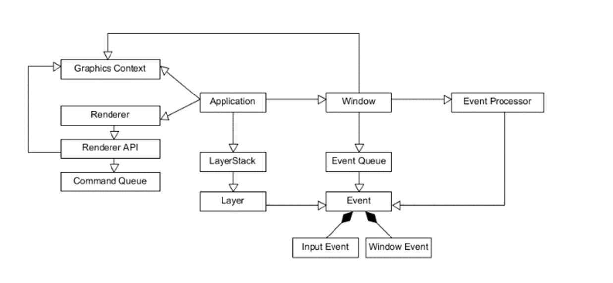

# The Core Systems
---

To implement a renderer algorithm, we need a pipeline that can support this. The core systems of our prototype have the following structure. [Figure 27] shows a system diagram of the prototype. 

  

    <i>
    Figure 27: API of the prototype
    </i>

In a typical scenario, the user will generate a 3D model in a 3D software package such as Blender [] or 3ds Max []. We give this geometry to our asset pipeline to create a distance field (We did not visualise the asset pipeline within the figure). This generated distance field is loaded into our prototype to provide it to the renderer. The renderer updates the viewport automatically, switching between several rendering methods depending on user actions and system capabilities. 

## The Application

The application is the first code executed after entering the entry point. The application is responsible for initialising each sub-system within the framework. Those sub-systems will consist out of: the window, where we will visualise our final render, the renderer, which will perform requested draw calls, the event queue that will handle user input.

## The Layer Stack

We can explain the layer stack best when we think about an application such as Adobe Photoshop. If we adjust something or apply something on layer one, layer two remains untouched. This principle is translated to our prototype when using the even system. An event is processed in the uppermost layer first, and only if we did not handle the event we propagate the given event down on the layer stack. Using this principle, we can prevent handling events twice as well as giving specific layers priority over others. For example: when we click on the UI layer of our application, we will not trigger mouse events in the viewport.

## The Window

The window is responsible for two things. First, we will need to handle incoming events from the OS when an input or window event has occurred. These events can be the mouse moved, the application lost focus, the user pressing a key. We sent these events to the event processor. This processor will format the incoming OS events into something our prototype can understand before pushing them onto our layer stack.

## The Graphics Context

Besides the layer stack and creation of the window, our application will create a reference to the graphics context. In our case, this will be an OpenGL context.

## The Renderer

The renderer is responsible for rendering our lattice structure on the screen. We queue render-instructions in the form of commands. We can use these commands to keep a log of the instructions sent to the GPU. If we swap between different rendering techniques, we can measure the outcome of each different technique together with each command required to make that technique possible. We utilised a technique called deferred rendering within this prototype to visualise our triangle rasterisation approach. Our distance field renderer starts off differently but produces a similar G-buffer after being executed. 

## The Renderer API

The renderer API is an extra abstraction layer added to our prototype that will make our life easier when we plan on using this prototype on different platforms. The target use case of this prototype is to generate a web assembly build we can easily convert our OpenGL API to OpenGL ES API.