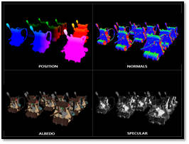

# Forward versus deferred rendering
---

Forward rendering, also known as forward-shading [Figure 28], is a technique in which every object in the picture is lit immediately by every light. This means that for each pixel on the screen, we must first decide whether an object is visible before performing the light computation. While forward rendering is simple to construct, it is not without flaws. 

  

    <i>
    Figure 28: Forward shading diagram
    </i>

Consumer graphics cards can process thousands of triangles; the main bottleneck is that those triangles or the vertices eventually get sent to the fragment shader. We calculate expensive light calculations within the fragment shader to determine how to shade a pixel. Forward shading tends to waste a lot of fragment shader runs in scenes with a high depth complexity as fragment shader outputs are overwritten, and some calculations might be wasted [Figure 29][12].

  

    <i>
    Figure 29: Visualisation of forward rendering overdraw
    </i>

Deferred rendering or deferred shading is based on the idea that we defer most heavy calculations (such as light calculations) to a later stage. We can achieve deferred shading with one geometry pass and one light pass. The geometry pass renders the scene once and stores distinct data about the displayed geometry in different textures, commonly known as the G-buffer. Position vectors, color vectors, normal vectors, and/or specular values make up the majority of this data. A visualisation of the G-buffer can be found within [Figure 30]

  

    <i>
    Figure 30: G-Buffer of a single frame
    </i>

In the second pass, we render a full-screen quad and calculate the final render using the provided G-buffer. We only need to do our light calculations once when deferring them to a later stage because the G-buffer contains all of the data from the topmost fragment. However, there are some drawbacks to employing deferred shading, such as the fact that we can no longer support any type of blending because we only get information from the topmost fragment. There are some remedies for this difficulty. However, we will not go into detail about them in this thesis. Another disadvantage of this method is that it necessitates the storage of a significant quantity of scene data in texture color buffers. The quantity of memory we consume is severely taxed by this. 

We use deferred shading when we require many dynamic lights within the scene. Deferred shading can render an enormous amount of light sources without a high cost on performance. At the same time, deferred shading in itself does not improve performance by a large margin, especially within more miniature scenes. We still have to do the work for each pixel on our screen, even though we execute our calculations only once. Most 1080p monitors have a pixel count of over 2 * 10^6  pixels, those are still many calculations that have to be made. The reason why deferred shading can render this more considerable amount of light sources is that it uses light volumes.

## Light Volumes

The concept behind a light volume is that we determine the radius of our light source or the range of light we can illuminate. We may use the maximum distance our light can travel, also known as the attenuation of a light source, to determine which piece is inside or outside our light volume. We do not need to perform any expensive lighting computations for a piece that is beyond our light volume.

To calculate the attenuation of our light volume, we consider the following formula:

<i>F_att=  1.0/(K_c+ K_l*d+ K_q* d^2 )</i>

The distance between the fragment and the light source is represented by d. Then we construct three (configurable) terms to determine the attenuation value: a constant K_c a linear term K_l and a quadratic term K_q. The constant value is commonly set at 1.0. Its major purpose is to limit the denominator from falling below 1.0, which would otherwise raise the intensity of a light source over certain distances, which is not the desired result.

The linear term is multiplied by the distance value, which diminishes the intensity linearly. The quadratic factor is multiplied by the distance value’s quadrant, resulting in a quadratic drop in intensity. When the distance is modest, the quadratic term is less significant than the linear term, but it becomes significantly more relevant as the distance increases. [97]

The OGRE wiki [98] demonstrates what values might be passed for certain attenuations [Table 2]. These variables depend heavily on what environment we are in, the distance we want the light to cover, what type of light source it is, etc. Therefore, most games provide some form of an editor where an artist can tweak these values to their needs.

For our light volumes to resolve in the brightness of 0.0, we must solve our attenuation equation to 0.0. As these equations will never reach zero, this is not possible. We could solve to a value that is nearly 0.0 but would still perceive as black to the human eye. We have chosen a brightness of 5/256 as an acceptable range within our demonstrations. We require the division by 256 as an 8-bit frame buffer can only display that many intensities per component. This leaves us with the following equation to solve:

<i>5/256=  I_max/(K_c+ K_l*d+ K_q* d^2 )</i>

Here I_max  is the light source’s brightest color component. From here, we can solve this equation as follows:

<i>K_q*d^2+K_l*d+K_c-I_max*256/5=0</i>

With this function being a quadratic ( ax^2+bx+c=0 ) we can solve this using the quadratic equation:

<i>x=(〖-K〗_l+√(K_l^2-4*K_q*(K_c-I_max*256/5)))/(2* K_q )</i>

We can use x, i.e., as the light volume’s radius, to only calculate lighting for that light source if a fragment is inside the light source’s volume. However, checking against this value within the fragment shader will not work in practice. The GPU and OpenGL Shading Language (GLSL) is bad at optimising loops and branches, which will happen when we loop over all our lights within the scene. This is because shader execution on the GPU is highly parallel, and most architectures have a requirement that for an extensive collection of threads, they need to run the same shader code to be efficient. This often means that when we run a shader, it will execute all branches of an if statement to ensure the shader runs are the same for that group of threads, making our previous radius check optimisation completely useless.

The appropriate approach to using light volumes is to render actual spheres scaled by the light volume radius. We position the centers of these spheres at the light source’s position, and as the light volume radius scales, the sphere exactly encompasses the light’s visible volume. The trick comes in when we use the deferred lighting shader for rendering the spheres. As a rendered sphere produces fragment shader invocations that exactly match the pixels the light source affects, we only render the relevant pixels and skip all other pixels [13].

We execute this principle for each light source in the scene, and the resulting fragments are additively blended. The result is the same scene as before, but we only render the relevant fragments per light source. Using this algorithm effectively reduces the computations from:

<i>nr_objects * nr_lights => nr_objects + nr_lights</i>

This formula shows why deferred rendering is so suitable for rendering a large number of lights. However, using this approach, there is still an issue: We should enable face culling; otherwise, we would render our light effect twice. When it is enabled, we have to render the back faces of our spheres, as the user may enter a light source’s volume, after which the volume is not rendered anymore due to back-face culling.

Using light volumes does take its toll on performance. Usually, it is much faster than regular deferred shading when using a large number of light sources. We can still optimise certain aspects of it. Two other popular (and more efficient) extensions on top of deferred shading exist called deferred lighting [99] and tile-based deferred shading [100] 