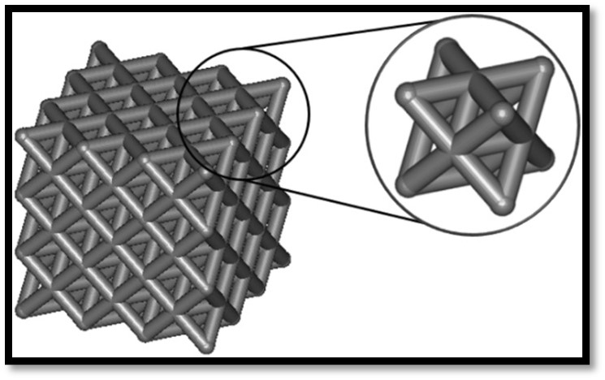
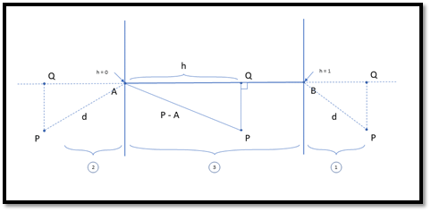

# Distance Functions

## Distance function of a lattice structure

If we return to our question, lattice structures are complex geometric figures, as shown in [Figure 2]. They represent a geometrical arrangement of crisscrossed patterns. As stated in the previous chapter (3.1.2), we can calculate implicit shapes by providing a distance function. We can generate a distance field of a lattice by brute-forcing a triangle trace towards a mesh. However, if we zoom in on a lattice structure, we can observe that a lattice structure is made up of unit cells. A single unit cell can be constructed by joining numerous line segments together. Chapter 3.1.3 talked about Boolean operations, and a lattice structure is an outcome of some of these operations. 
Joining these line segments is also known as taking the union of each segment within our unit cell. As such, we can generate a distance function for these line segments and create our lattice structure on the fly without any offline preparation.

Inigo Quilez has an excellent explanation of calculating an SDF to a line. Using this formula, we can perform a union operation between multiple line segments arranged in different formats [Figure 15] to create a single unit cell of a lattice structure. The next chapter will explain how such a distance function can be computed. 

  

    <i>
    Figure 15: Example of a single unit cell within a lattice structure
    </i>

## Distance function of a line segment

In this section, the mathematical formula for calculating the distance towards a line segment is explained. The following [Figure 16] is an illustration of the final result. Each element within this figure is described in this chapter. 

  

    <i>
    Figure 16: Algorithm to calculate the distance to a line segment. Each element within this illustration is mentioned in chapter 3.1.5
    </i>

We can define a line segment by two vertices called A and B. Three different regions arise when computing the distance from a point P to a line segment. If we take the distance in region 1 from point P towards the line segment, this will result in the following formula:

<i>d=|P-B|</i>

Similarly, if we have a point in region 2, the distance from a point P is the distance between the point P and the vertex A of the line segment; we can define a formula as follows:

<i>d=|P-A|</i>

If P is in region 3, the distance between the point P and the segment equals the distance to the closest point, Q. Our point Q is located between vertex A and B on the defined line segment. A parameter h can be defined to tell us how far along the line segment Q is located. If this equals 0, Q will be located at position A. If this equals 1, Q will be located at position B. We can find the value of h by projecting the vector  |P - A| into |B – A|. We can evaluate the projection using the dot-product between both vectors. The dot-product will take the length of both vectors into account because we only need the length of h eventually; we must divide the computed dot-product by the length of |B – A|. Now that we have the entire length of the projection, which goes from 0 to the whole length of |B – A|, we can normalise this outcome by dividing by the length of |B – A| again. This will give us the following formula to calculate h:

<i>h=(<P-A,B-A>)/〖|B-A|〗^2</i>

This means we can interpolate between A and B using the value h to find our point Q and compute the distance between a point P and a point Q accordingly. 

<i>d=|P-(A+h(B-A))|</i>

To solve this, we can use hardware-accelerated functions called min/max, and depending on the location of point P. We can combine these functions into one single formula. Notice that when our point P is in region 1, our value of h would be larger than 1 since P would project into a point Q above B. If we force h to be 1 when the computed value is bigger than 1, we will successfully recreate the distance towards our point B; similarly, if our point P is within region 2, our value of h would be smaller than 0. If we clamp this value towards 0, we will successfully recreate the distance towards our point A. This means we can compute as usual and clamp it to a region between 0 and 1.

<i>h=min⁡(1,max⁡(0,(<P-A,B-A>)/|B-A|^2 ))</i>

This will allow us to have one single expression without branching in the code to calculate the distance to a line segment.

<i>d=|P-A-h(B-A)|</i>

Note that nowhere in the expression is there any explicit mention of an x, y, or z component or a cross-product or anything that would lock us in each number of dimensions. We have only used dot-products and distances, which we can translate to any number of dimensions. This means that the expression we have formulated here also works in three dimensions. If we would subtract an amount r (iso-surface value) from our evaluated distance, we can define the thickness of our shape, which is currently an infinitely thin line segment. 