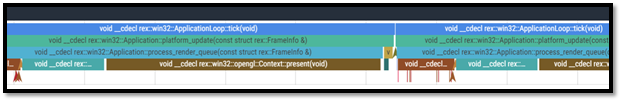

# Iteration Process
---

This section will explain how a single iteration process would be executed and measured. We will also display the findings of this iteration within this chapter. 

A baseline was established with the given geometry seen in [Figure 22]. 

  

    <i>
    Figure 22: Block of a lattice structure
    </i>

This geometry is rendered using a deferred renderer. All figures uploaded to the GPU are exported from Blender (version 2.93.1) and can be found in [Appendix A.5]. Each iteration will illustrate the initialisation stage first. This initialisation stage contains loading the requested asset from disk. This is either a mesh in .obj format or a volume exported from an offline tool that uses the library libigl [96] to generate a distance field. Compilation of the shaders used to generate a frame visualising a given scene is also done in the initialisation stage. The initialisation stage is entirely executed on the CPU. The following table [Table 1] illustrates the timestamps for each individual function executed within the initialisation stage.
 
 

|Function Name      |   fka - HD |
|:---               |:---                   |
| **rex::win32::Application::create_display_manager** |17838|
| **rex::win32::Application::create_layer_stack** |14|
| **rex::win32::Application::create_event_queue** |10|
| **rex::win32::Application::create_window** |204345|
| **rex::win32::Application::create_input** |1|
| **rex::win32::opengl::Context::make_current** |1|
| **rex::win32::Application::create_context** |4693|
| **rex::win32::Application::create_application_loop** |92|
| **rex::ResourceFactory::initialize** |0|
| **rex::Renderer::initialize** |1420|
| **rex::Renderer::set_viewport** |5|
| **regina::deferred_rendering::create_focus_settings** |0|
| **regina::deferred_rendering::create_orbit_settings** |1|
| **regina::deferred_rendering::create_mouse_settings** |0|
| **regina::deferred_rendering::create_orbit_camera_description** |26|
| **regina::deferred_rendering::load_shader** |2525.25|
| **regina::deferred_rendering::load_shaders** |10245|
| **regina::deferred_rendering::load_primitive_geometry** |149|
| **regina::deferred_rendering::load_custom_geometry** |6604439|
| **regina::deferred_rendering::load_custom_geometry** |6604485|
| **regina::DeferredRenderingLayer::setup_lights** |133|
| **regina::DeferredRenderingLayer::setup_geometry** |32|
| **regina::DeferredRenderingLayer::setup_scene** |233|
| **regina::DeferredRenderingLayer::setup_camera** |16|
| **regina::deferred_rendering::create_deferred_geometry_pass_options** |1|
| **regina::DeferredRenderingLayer::create_deferred_geometry_pass** |11|
| **regina::deferred_rendering::create_deferred_light_pass_options** |0|
| **regina::DeferredRenderingLayer::create_deferred_light_pass** |1|
| **regina::deferred_rendering::create_deferred_light_visualisation_pass_options** |1|
| **regina::DeferredRenderingLayer::create_deferred_light_visualisation_pass** |0|
| **regina::deferred_rendering::create_composite_pass_options** |0|
| **regina::DeferredRenderingLayer::create_composite_pass** |1|
| **regina::DeferredRenderingLayer::setup_scene_renderer** |281|
| **regina::DeferredRenderingLayer::on_attach** |6615477|
| **rex::LayerStack::push** |3307746|
| **rex::win32::Application::push_back_layer** |3307753.5|
| **regina::Application::on_app_initialize** |6615611|

    <i>
    Table 1: Full list of functions called during initialisation
    </i>

[Figure 23] shows a more visual representation of these values after loading them into the Chrome Tracing Tool. Note that the visualisation only represents a partial view of the table above. 

  

    <i>
    Figure 23: Full list of functions called during initialisation visualised in the Chrome Tracing Tool
    </i>

We believe timings that take less than 1 ms within this stage to be irrelevant to the measurements, so these data will be removed from the final result. Implementations such as the setup of the scene, camera, creation of the application window, etc., do not influence the loading times nor the framerate of the application and will also be removed from the final result. A cleaned-up version is shown below [Table 2]:

|Function Name          |   fka - HD    |
|---:                   |:---:          |
|**Loading shaders**	| 10.245 ms     |
|**Loading geometry**	| 6604.485 ms   |

    <i>
    Table 2: Measurements of the lattice structure during the initialisation stage utilising a deferred renderer
    </i>

The update loop for each iteration is run for 500 frames (on a system that can exactly reach 60 FPS, this is equivalent to 8.3 seconds). Each scene rendered is constructed out of a specified mesh or volume and a set of cubes that represent the light sources present in the scene. We picked 32 light sources for this iteration step. The scene also contains a simulated camera that spins around the supplied geometry, eliminating any human interaction. By simulating the camera, each movement will be exactly the same as different movements might yield different results. Finally, as mentioned in the 

 

enumeration of parameters in Chapter 3, each scene can be renderer in HD or 4K. We rendered this iteration in HD. Measurements of the update loop of this iteration can be found in [Table 3]. As with the initialisation stage, this table has been trimmed of functions that take up less than 1 milliseconds and implementation details.

|Function Name          |   fka - HD    |
|---:                   |:---:          |
|**Update**	            | 3.916 ms      |

    <i>
    Table 3: Measurements of the lattice structure during the runtime stage utilising a deferred renderer
    </i>

An illustration of the runtime stage viewed within the Chrome Tracing Tool is shown in [Figure 24].

  

    <i>
    Figure 24: Full list of functions called during runtime visualised in the Chrome Tracing Tool
    </i>

The next stage of an iteration is to repeat this process with a distance field renderer. We transformed the geometry seen in [Figure 22] into an SDF with a voxel count of 300 on the longest edge of the bounding volume. Only the input is converted into an SDF, the cubes representing the light sources are rendered using a rasterised approach. The sphere tracer was configured with a max step count of 100, 200, 500, and 900, a minimum surface distance of 0.01, and a max marching distance equal to the far plane of the camera.  

|                   |   FKA – Unit Cell – i100	| FKA – Unit Cell – i200	| FKA – Unit Cell – i500	| FKA – Unit Cell – i900 |
|---:               |:---:                      |:---:                      |:---:                      |:---:                   |
Loading shaders	    | 243.410 ms	            |117.760 ms	                | 114.390 ms	            | 120.830 ms             |
Loading geometry	| 4097.390 ms	            |1334.790 ms	            | 1298.760 ms	            | 1322.710 ms            |

    <i>
    Table 4: Measurements of the lattice structure during the runtime stage initialisation stage utilising a distance field renderer
    </i>

|       |   FKA – Unit Cell – i100	| FKA – Unit Cell – i200	| FKA – Unit Cell – i500	| FKA – Unit Cell – i900 |
|---:   |:---:                      |:---:                      |:---:                      |:---:                   |
Update 	| 3.557 ms	                |4.466 ms	                |5.404 ms	                |5.554 ms                |

    <i>
    Table 5: Measurements of the lattice structure during the runtime stage utilising a distance field renderer
    </i>

We can use a heatmap to visually illustrate the sphere tracers' steps when extreme slow-downs occur. We can take these bottlenecks into account when setting up a new iteration. The heatmap of this iteration can be seen in [Figure 25].  As explained in Chapter 3.4.3 a color ramp is utilised to indicate the sphere trace step count. In [Figure 25], blue represents a low step count and red represents a high one.

  

    <i>
    Figure 25: Heatmap of the lattice structure.
    </i>

Both rendering techniques will be compared and accessed in which scenario one should pick geometry over a distance field and when one should select a distance field over geometry. When an output is defined, one of the listed parameters is changed, and this process is repeated. After listing all possible scenarios, we argue that a clear overview of scenarios where distance field rendering is preferred over rasterisation would occur.