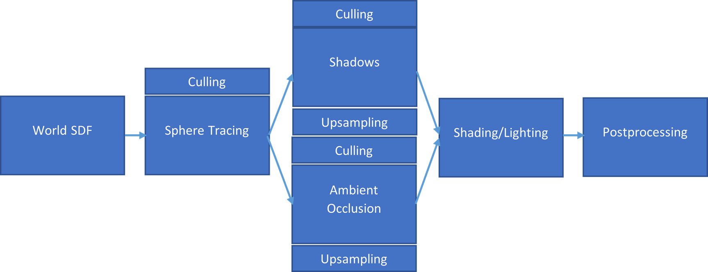

# Iterations

To quickly iterate over our prototype and measure different aspects of the rendering pipeline individually, we will split up our rendering pipeline into multiple steps that have no dependencies on each other [Figure 21]. 

  

    <i>
    Figure 21: Example of the split-up modules
    </i>

This enables easier optimisation and works on a specific part of the pipeline while not touching the other elements. Secondly, if desired, each module could be switched out quickly for a conventional rendering technique. The modules operate independently on buffers provided by the preceding steps. For example, the sphere tracing step could be replaced by conventional geometry rasterisation using a deferred rendering approach. We could also replace distance field shadows and ambient occlusion with shadow mapping and Screen Space Ambient Occlusion (SSAO).