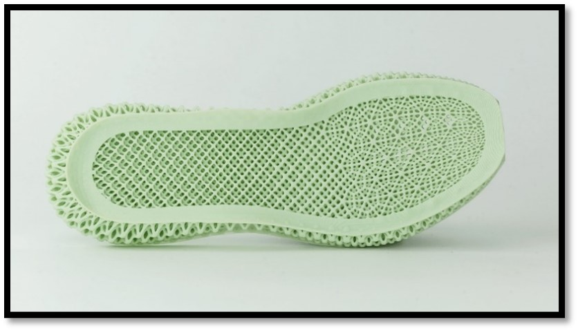

# Lattice Structures
---

One complex geometrical figure emerging quite often in this industry is a lattice structure. An example of this type of structure is shown in [Figure 2]. According to PTC, lattice structures can be defined as follows: “A lattice structure is a space-filling unit cell that can be tessellated along any axis with no gaps between cells”. The AM  industry is interested in these kinds of shapes because they are “lightweight,” a term used within the AM industry to define an object requiring less material to manufacture and therefore have a weight reduction while maintaining the stability and flexibility of the build.

  

    <i>
    Figure 2: Example of a lattice structure in the shape of a shoe – Carbon 3D
    </i>

Different applications already exist within the industry that uses lattice structures, such as the aerospace industry, to create fuel-efficient jet engines or 3D printed orthoses within the medical industry. In [Figure 3], we can see an example of a brace to fortify a person’s wrist. While it is not easy to shower or go swimming with a plaster brace, this type of brace does not absorb water and provides all support required.

  

    <i>
    Figure 3: 3D printed orthosis
    </i>

However, the creation of these structures does not come easy. A 3D printer requires a 3D model to print a product. This model has to be designed and visualised by a designer working on this product. The vertex count of a lattice structure can take a heavy toll on the GPU for larger lattice structures. Therefore, interacting with these 3D models can become a challenge on current sub-optimal hardware such as phones or tablets. 