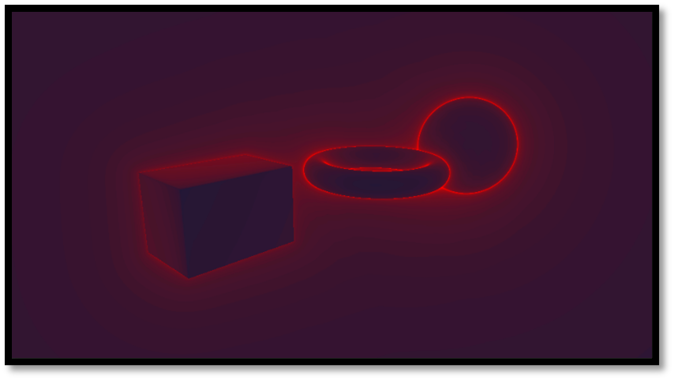

# Measuring the prototype
---

This thesis compares distance fields against traditional rasterisation when visualising complex structures. Our motivation is to showcase if distance fields are a reliable solution for complex structures within current or future renderers.

We talked about different algorithms in chapter 3.1 and how these techniques could be applied. The second part of our methodology chapter displays how to tackle the measurement of such an experiment. We will try to illustrate that real-time distance field rendering is feasible for modern hardware by employing the correct acceleration techniques.

Our renderer is written in C++ and communicates with the hardware via the OpenGL API. The created framework was instrumented with specific logic to measure our application in precise locations, also known as instrumentation. This will result in a future-proof solution for retrieving accurate results on various devices. When we test our software on different platforms like phones and tablets, we may toggle profiling on and off on the fly if any unexpected slowdowns emerge on an untested device. 

A heatmap can be exported or displayed to measure the ray marcher on the GPU. This heatmap will illustrate the number of iterations our ray marcher must go through when tracing our distance data. Utilising this heat map, we can identify the ray marcher’s high-performance expenses and optimise accordingly. 

By employing various modules within our renderer, we can switch between different techniques without affecting other portions of the experiment. This will give us more accurate results when measuring larger parts of the prototype itself.

In the upcoming section, we will dive a little deeper into each specific tool we will use to create and measure our prototype.

## C++

The collected data will come from an OpenGL renderer written from scratch. This framework will give us more control over what is measured and how we can measure it. There will be little to no overhead of different systems running in the background by well-known frameworks such as Unity or Unreal. We have chosen C++ as a programming language to implement this prototype. C++ is a performant programming language used within the real-time-rendering industry almost everywhere. Many games engines, such as Unreal Engine, Unity, CryEngine, Godot, and Frostbite, are written in C++ because of their speed. 

## Performance Measurements

When diagnosing performance problems, it can be valuable to see what our application is doing “under the hood”. If we look at profiling, benchmarking, and performance measurement, we need a tool to record these metrics. This will help determine what variables are important when measuring the application and why those variables are essential. 

One way to get a more detailed view of what is going on is to use the profiling tool [88]. Most profilers regularly examine a running program to see what assembly instruction is currently being executed and which routine called the current function — also known as a sampling profiler. This sampling profiler can work with standard binaries but gives more helpful information if we can provide debugging symbols. The debug symbols can work out the lines of the given function addresses to find them within the code-base. We can also sample after a specified number of events. Cache misses, for example, will show us where areas of our application are slowing down because of memory access. Other profilers require recompiling the program to include specialised instructions — also known as instrumentation. The instrumentation strategy can provide precision and data, but it will slow down the application, changing the metrics output. However, an added benefit of instrumentation over a sampling-based approach is the ability to integrate the profiling code within our framework. This means that with the flip of a switch, the profiler can be enabled or disabled and document it. A sampling approach will require an external tool as it is a lot more work to create this independently. This tool might be different on other platforms, and various tools might yield different results depending on how they approached their sampling method. 

Visualising this data on a graph helps us better understand what is going on instead of looking at a sheet of numbers. Different profiling tools are available and most Integrated Development Environment (IDE)s, such as Microsoft Visual Studio, have a built-in profiler that can help us track our application’s execution time or memory output. Standalone applications, such as CodeXL or Sleepy, can do the same. We used a tool called Chrome Tracing and an instrumentor to visualise our measurements.

Chromium is a free and open-source web browser project developed by Google. Specialised tools have been made for chromium web-browsers, such as “The Tracing Event Profiling Tool” (also known as Chrome Tracing). We may export the output of the instrumented code within our code-base in a JavaScript Object Notation (JSON) format that is readable by the Chrome Tracing tool. This allows us to display the data in a graph and analyse it more effectively.

## Sphere tracing measurements
 
When we implement the sphere tracer, it might be helpful to visualise the performance of our sphere tracing shader. One way of doing this is to count how many times we “map” the distance functions within the fragment shader and represent this as a frame buffer that we can visualise. We can create this visualisation [Figure 20] by modifying the standard sphere tracer to output the number of samples per frame. If we map the number of samples in a given pixel to a color ramp, we can construct a heatmap that illustrates the number of iterations we took to shade a pixel.

  

    <i>
    Figure 20: Heat map of the ray marcher iteration steps
    </i>

