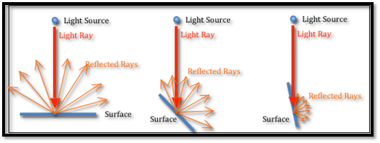

# Normals
---

Surface normals are used in most lighting models in computer graphics to calculate what hue a material should be at a particular position on the surface. When using simple diffuse lighting, the item will appear brighter as its fragments align closer to the light beams from a light source [Figure 17].

  

    <i>
    Figure 17: Diffuse light reflection
    </i>

Within a singed distance function where surfaces emerge from f(p), p is a point in space. The normal is retrieved differently. First, we can sample two points (or three points in 3D) on a curve’s surface from any arbitrary shape relatively close to each other. Drawing a line through them results in the slope of that curve. After that, we normalise the result to get the normal of the surface point. In more technical terms, the gradient of the SDF at locations on the surface can be used to compute the normal n of a certain iso-surface.

<i>n=normalize(∇f(p))</i>

We will discuss surface normals and their impact on the application in the discussion chapter 5.