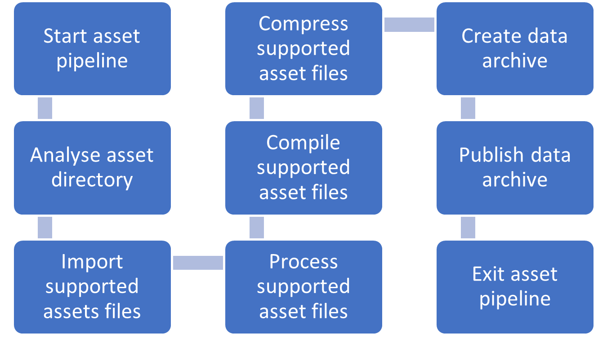

# Offline Stage
---

Before we can start rendering, we must create a data structure that will be used as a mold to be filled with unit cells. Even though this section of the program is not the focus of this thesis, it is crucial to understand what sort of input data is required to mimic the results of this experiment. A visualisation of this stage is shown in [Figure 18] 

  

    <i>
    Figure 18: Demonstration of the pipeline when processing assets in the offline stage.
    </i>

The input data should include the mesh we want to “lattify” and a configuration file for setting up the lattice. This configuration file may include information such as which unit cells to use, the thickness of each unit cell’s beams, when to shift to a new unit cell, the size of each unit cell, etc.

We can brute force triangle ray trace towards our input mesh to retrieve a mold (also known as outer shape). Our mold should represent the input mesh as a signed distance field to easily intersect it (using an intersect Boolean operation) with the distance evaluations of the unit cells. This will result in the given shape being filled with unit cells. The result of this triangle trace can be stored in a 3D texture (we used a 32-bit floating-point texture) that can be imported later on once our prototype starts. Besides the distance field of the mold, we will be using a second 3D texture (also 32-bit floating point) that can be stored on disk that has information for each unit cell present within our lattice structure. This will give us the ability to switch between different unit cell distance functions on the fly when rendering our lattice structure. The thickness of our unit cell beams, as well as the iso-value we want to visualise our lattice structure on, are also stored within this texture.
