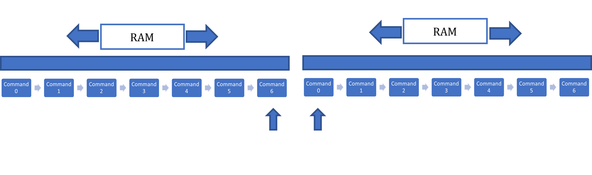

# Online Stage
---

The online stage within this experiment is the focus of this thesis. In this section, we will explain the pipeline of our prototype from start to finish. Initially, when the prototype starts, it would import our generated data from the offline stage. We should have both 3D textures (mold distance field and unit cell information) and a configuration file in memory once the import stage is completed. 

Next, the application loop will start the command queue, storing all our graphics commands and reset our queue’s stack pointer, replacing any existing memory within the queue ready to be overridden by possible new commands. A visual representation of the command queue can be found in [Figure 19]

  

    <i>
    Figure 19: Illustration of the command queue with the render pipeline.
    </i>

Both 3D textures and uniform buffers, which provide settings for viewing our lattice structure, are bound to our graphics pipeline so we can push a draw call to render a full-screen quad on the command queue. 

After we issue all graphics commands, we can end the command queue and begin executing all stored commands in our command queue. When we transmit all instructions to the GPU, we may present our swap chain and swap the back buffer with the front buffer (in a double-buffered system). We will try to repeat this process 60 times per second (depending on the hardware we are running on) until we request a shutdown of the prototype.

A step-by-step overview is given in [Appendix A. 4] on how we compute the outcome of a single pixel. The computation of such pixel goes as follows: when we issue a draw call, the GPU will respond by spawning multiple threads to run our shader programs. We will start our sphere tracer within the fragment shader and march along a ray. The distance evaluation will consist of a trace towards our unit cells (a.k.a. a union of line segments) and an intersection of that unit cell trace and the SDF we uploaded as a 3D texture (which represents the mesh we want “lattified”). We apply any specified factors that could influence this distance value, such as the iso-value of our lattice structure, clipping of the lattice, etc. 

If our distance evaluation results in a surface hit (a.k.a. we reached a minimum threshold), we can compute the normal of the surface position we hit. This is done by computing the gradient of the SDF at locations on the surface. We will also determine the albedo and specular information of the surface we hit. We stored this information in a separate lookup table, as different surfaces might have different colours and specular information. When a hit occurs, the distance value and a surface ID are returned to the callee of our raymarching function. This ID is used to look up what material parameters should be used for the surface that was hit.

All this information (surface position, surface normal, albedo, and specular) when a hit occurs is stored within the G-buffer. This buffer can be used by other stages of our pipeline to acquire the final render of our scene. 
