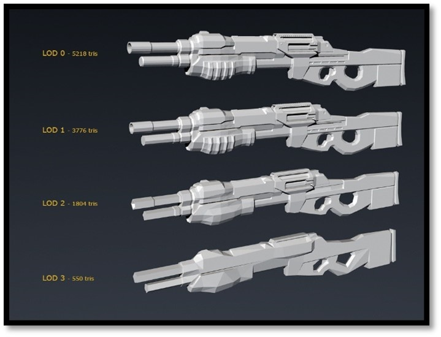
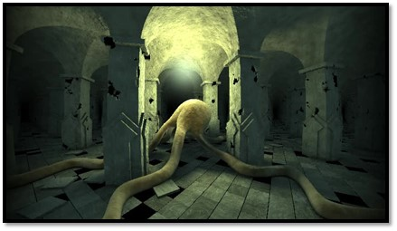

# Rendering Techniques
---

As hardware capabilities improved throughout the years, 3D geometry has reached a new level of complexity. Different techniques have been introduced to solve the problem of rendering complex geometry. For example, Level of Detail (LOD), shown in [Figure 6], is a method that can decrease the complexity of a 3D model based on specific criteria. These criteria might be object relevance, camera distance, viewport-relative speed, etc. This technique is not limited to 3D geometry; also, textures make use of LOD, also known as mipmapping or shaders, to control pixel complexity. Chapel Hill has published an excellent paper about LOD: “Hierarchical Levels Of Detail To Accelerate The Rendering Of Large Static And Dynamic Polygonal Environments.”

  

    <i>
    Figure 6: Example of a weapon with different LODs
    </i>

A streaming service such as Google Stadia or Xbox Remote Play could provide high-end applications to the web with no compromise on rendering quality. No installation is required as one could compare streaming an application to streaming a video from Netflix, Disney+, or any other video streaming service. The difference between streaming an application and a video is that users can also interact with the application. This technique offloads all the heavy lifting to the cloud. 

Even though techniques such as level of detail, mesh shaders, and streaming services have a variety of use cases, they could not provide a solution to our problem. Downgrading complex structures using a LOD in a medical application could obscure or remove essential features that a user requires. A streaming surface such as pixel streaming is not easy to maintain from a business point of view. Infrastructure needs to be maintained, and costs can run up high. Although a streaming service would work, our opinion about using this technique is that we do not see this working in the field. Looking at the previously given examples, LOD, streaming, or using mesh shaders mentioned in chapter 2.4, we concluded that we would not reach our goal by using existing techniques requiring geometric data (such as vertices and indices). 

However, we do not require geometric data to project a 3D model on the screen. Another approach to rasterise geometry is by defining them mathematically. We can calculate the distance to an object within a scene and generate a distance field using implicit functions. A distance field is an n-dimensional array of numbers that store the distance value of some point in space to the surface of a shape. Distance fields have been used in computer graphics for over 25 years. The groundwork for this technique has roots in the image processing world as algorithms for Euclidean distance mapping have been in use since early 1980. In the 2000s, distance fields gained more attention as the 4kb demo from Inigo Quilez [Figure 7] showed how compact renderers could become when using distance fields.

  

    <i>
    Figure 7: Slisesix – Inigo Quilez
    </i>

Scenes can be mathematically combined and manipulated into a coherent distance field to create shapes that would be hard to produce with more traditional modeling methods. These operations are called Boolean operations, consisting of three basic operations: a union, where we add two objects together; the subtraction, where we subtract one shape from another; and the intersection, where we return only the intersection between two bodies. Keep in mind that these operations are examples and that there is no limitation in how we interpret any given distance value. In other words, distance fields have shown promising results in visualising high fidelity geometry. Different techniques exist to speed up the calculation of a distance field, such as the adaptive sampling of a distance field by Frisken et al. These calculations remove the elegance of a distance field as they would complicate the algorithm by using a data structure called an oct-tree. An oct-tree is a spatial data structure where each internal node has eight children. An oct-tree is mainly used to represent a relation between objects in a 3-dimensional space. For more information about oct-trees, one could read Hanan Samet’s book: “The Design and Analysis of Spatial Data Structures”. Using oct-trees, the memory footprint of our application would increase, as an oct-tree requires storage to read the stored nodes. For this reason, we used an algorithm from the raymarching family called sphere tracing. In his paper, John Hart has described this technique: “Sphere Tracing: A Geometric Method for the Antialiased Ray Tracing of Implicit Surfaces”. 

Based on the literature review and the presented difficulty of rendering complex geometry using triangle rasterisation on low-end hardware such as mobile phones and tablets and having no support for state-of-the-art features such as: mesh shaders to achieve this goal. We argue that, instead of rasterising each triangle of a lattice structure, we could use an algorithm called sphere tracing to evaluate distances towards the surface of the lattice structure, removing the barrier of having a high-end device and allowing users to run such an application on any device.

As such, we propose the following research question: How do evaluations of distances towards the surface of lattice structures compare to traditional triangle rasterisation of lattice structures?
 
