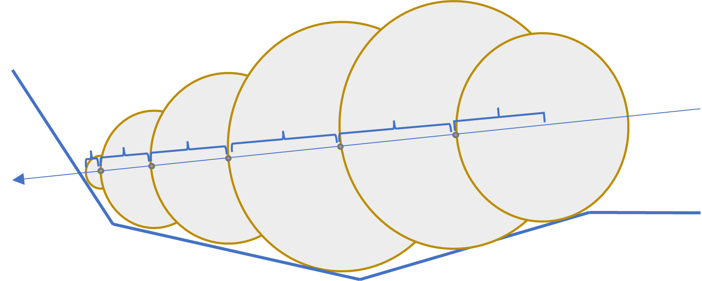
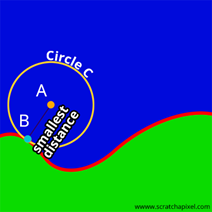
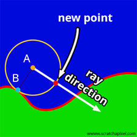
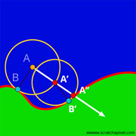

# Sphere Tracing
---

Visualising a distance field can be achieved by using an algorithm called sphere tracing. Sphere tracing [Figure 8] is a technique for rendering implicit surfaces using a geometric distance. 

  

    <i>
    Figure 4: Sphere tracing visualised
    </i>

John Hart published an important paper on this topic. To find the distance towards a shape, we need to define a distance function for it. For example, a sphere with center (x_0,y_0,z_0) and radius r can be represented in the following way:

<i>〖(x-x_0)〗^2+〖(y- y_0)〗^2+〖(z- z_0)〗^2=r^2</i>

If we consider that x, y, and z are the coordinates of point P and position our sphere on the world origin of (0,0,0), we can simplify the above equation as follows:

<i>P^2-r^2=0</i>

This equation is what is called an implicit function. A sphere represented in this form is also called an implicit shape. Unlike an explicit equation that can compute surface points based on parameters, an implicit equation only tells us if a particular point is inside a shape (negative values), outside a shape (positive values), or precisely on the surface (value of 0). The collection of points where the implicit function equals x is called an iso-surface of value x (or iso-contour in 2 dimensions). Sphere tracing is a method of drawing a surface solely based on this data.

Intersections between our defined implicit shape (in this example, a sphere) and a ray may be computed. The following equation can be used to represent a ray:

<i>O=tD</i>

Where O is the ray’s origin, D is the ray’s direction, and we use t to define any point along the ray. When t > 0, the point we describe is ‘ahead’ of the ray’s origin. When t < 0, the point we describe is ‘behind’ the ray’s origin, and when t = 0, the defined point and the origin are the same. If we combine both the implicit function of the sphere and the equation of a ray, our equation will give the following result:

<i>|O+tD|^2- r^2=0</i>

Hart’s technique is based on the idea that we can identify the closest point B on the surface of an implicit shape to any random point A in space. Once B is found, one can trace a sphere ( a sphere in 3D, a circle in 2D ) of radius ‖AB‖ around point A. From this point, we can make a helpful observation. If you start from A an move in any direction you like around A, you will not intersect the shape. [Figure 9]

  

    <i>
    Figure 9: Finding the nearest point on a surface. A circle is defined with a radius equal to the distance from the origin to the nearest point on the surface
    </i>

Hart took use of this discovery and computed the nearest point on the object's surface from the ray origin (the point A), then moved in the ray direction by a distance that does not exceed the circle or sphere radius (‖AB‖). The distance between the closest surface and the ray origin will become smaller and smaller by repeating this process. Eventually, the distance will have reached such a small value that it can be neglected and considered on the surface. This minimum value must be specified and might require some adjustments to reach optimal results. [Figure 10] [Figure 11]

  
  &nbsp&nbsp&nbsp&nbsp &nbsp&nbsp&nbsp&nbsp
  

    <i>
    Figure 10: We move along the ray direction by the radius of the circle. 
    Figure 11: We repeat the process from Figure 9 and Figure 10 until we reach a minimum threshold
    </i>

According to Hart, when we can supply a distance function for a shape, we can build up a scene with implicit shapes. Due to the nature of the sphere tracing algorithm, we know we will not intersect any shape that is present within this scene. In terms of our lattice structures, which are made up of a tessellation of unit cells, we may create a scene of unit cells and provide a distance function to each one. Afterward, we may utilise sphere tracing to determine the surface of those unit cells to portray our lattice structure correctly.