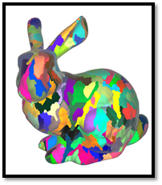

# Stage of the art
---

As visual fidelity improved within real-time renderers, so did the polycount of geometry required to be rasterised. Christoph Kubish stated the following: “The real world is a visually rich, geometrically complex place. Outdoor scenes can be composed of hundreds of thousands of elements such as rocks, trees, and small plants. CAD models present similar challenges with both complex shaped surfaces as well as machinery made of many small parts.“ Simulating real-world environments using the traditional pipeline requires high-end hardware, as shown by triple-A (AAA) game title requirements such as Battlefield 5 by DICE, Red Dead Redemption 2 by Rockstar Games, and CyberPunk 2077 by CD Projekt RED.

To reduce stress on the GPU, Nvidia ® introduced Turing. Turing is a codename for a GPU microarchitecture. The Turing architecture presents the first consumer product capable of real-time ray tracing. The introduction of this architecture has shown us another feature, such as a new programmable geometric shading pipeline through mesh shaders. Mesh shaders generate compact meshes; also known as meshlets; that can be directly used for consumption by the rasteriser. We can see an example in [Figure 5].

  

    <i>
    Figure 5: Standford bunny split up into meshlets
    </i>

Mesh shaders give developers the freedom to avoid bottlenecks in the geometry stages of the graphics pipeline. Christoph Kubish mentioned, “CAD data can reach hundreds of millions of triangles, even after occlusion culling. In this scenario, some fixed-function steps in the pipeline may do wasteful work and memory loads. The mesh shader gives developers new possibilities to avoid such bottlenecks.” Experts advise moving away from the legacy pipeline and moving towards a more flexible and general-purpose compute-based approach. Mesh shaders act very similarly to compute shaders and provide a programmable interface for developers to interact with the graphics pipeline and accelerate the rendering of heavy triangle meshes.

Unfortunately, support for state-of-the-art features is not available on every platform. Platform types such as mobile or the web either do not have the hardware capabilities or driver support for advanced features. Different techniques have to be used to support such platforms if desired.
